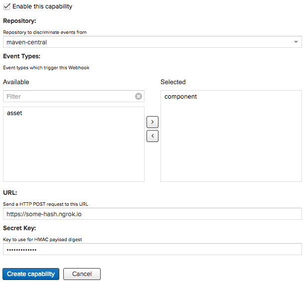
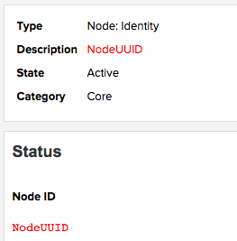

# Nexus for HipChat

## Description

Nexus for HipChat consumes Webhooks from Nexus 3 Repository Manager and creates HipChat notifications from their
content. It currently supports Created events for both Asset and Component Repository Webhooks. It can be used in
hosted repositories to monitor which artifacts are being published; allowing a team to monitor the components they
are working on. For proxy repositories, Nexus for HipChat can provide insight as to which new components are being
cached into the Repository Manager.

## Configuration

To utilize the Notifier, you must have a running instance of Nexus 3 Repository Manager. Webhooks can be enabled using
[Nexus Capabilities](//books.sonatype.com/nexus-book/3.0/reference/admin.html#admin-system-capabilities) and enabling
the Webhook: Repository Capability. Configure the URL to point to `https://deployed-location.com/nexus` and set a
Secret Key to ensure that the Webhooks received in the Nexus for HipChat originated from your Nexus instance.

### Nexus Capability Configuration

Once Nexus has been configured, [install](https://www.hipchat.com/addons/install?url=https://deployed-location.com/atlassian-connect.json)
Nexus for HipChat. In order to configure Nexus for HipChat you need to determine the Node ID of your Nexus server.
This is available in the Node: Identify capability settings, under Description and Node ID.

### Nexus Node: Identity

Fill out the Nexus Node ID and Secret Key from the previous steps. A Regex Filter can be used to filter the
notifications by the component or asset which triggered the event.

## Contributing

The source code for this addon is kept on GitHub at [sonatype/nexus-hipchat-notifier](//github.com/sonatype/nexus-hipchat-notifier).
It is licensed under Apache License, Version 2.0 and contributions are welcome through forks and pull requests.
Code should be formatted according to the Sonatype Code Styles available at [sonatype/codestyle](//github.com/sonatype/codestyle).
